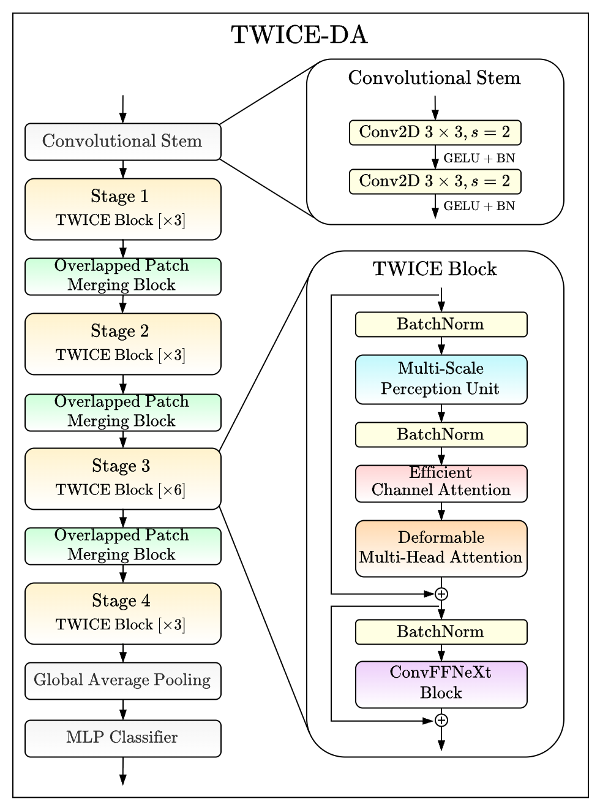

# TWICE-DA

This repository is the official implementation of **[TWICE-DA: Transformer With Integrated Multi-Scale Convolutional Extractor and Deformable Attention](https://computeroptics.ru/KO/PDF/KO50-1/500114.pdf?ysclid=mtobga4ai3234337)**.

TWICE-DA is designed as a **universal visual feature extractor** for a wide range of computer vision tasks.  
In this repository, we evaluate the effectiveness of the TWICE-DA encoder as a visual backbone for **image classification**.

## Architecture
TWICE-DA is a **lightweight hybrid architecture** that combines the strengths of CNNs and Transformers. The architecture follows a four-stage hierarchical structure, enabling the extraction and processing of visual features at different levels of abstraction.  
An overview of the encoder architecture is presented in the figure below.
<p align="center">
  
</p>

### Key Components
The hybrid nature of TWICE-DA is achieved through a substantial modification of the standard Transformer block, incorporating the following key architectural components:
1. **Multi-Scale Perception Unit (MSPU)** employs multiple parallel convolutional branches to extract local features at different spatial scales. It is placed before the self-attention mechanism to enhance positional information about object locations and introduce stronger convolutional inductive biases into the model.
2. **[Efficient Channel Attention (ECA)](https://arxiv.org/pdf/1910.03151)** dynamically identifies the most informative feature channels, enhancing important representations while suppressing less relevant ones.
3. **[Deformable Multi-Head Attention (DMHA)](https://arxiv.org/pdf/2309.01430)** dynamically samples a limited number of relevant spatial positions for each token using learnable offsets. This allows the model to effectively capture global context while significantly reducing the computational cost compared to standard MHSA.
4. **ConvFFNeXt** is a lightweight variant of the feed-forward network (FFN), in which a depthwise convolution is placed before the FFN layers, forming a more computationally efficient ConvNeXt-inspired block. The expansion ratio (e.r.) is reduced from 4 to 2, substantially lowering the computational complexity of the model with only a minor loss in accuracy.
5. **Batch Normalization** is used instead of Layer Normalization. Experimental results demonstrate that the use of Batch Normalization in TWICE-DA improves inference efficiency by approximately 15%, while also providing faster convergence and improved classification accuracy.

### Modification of the DMHA
We also propose a modification of the standard DMHA by introducing a **Multi-Scale Offset Generator**.  
The standard **Offset Generator (OG)** used in DMHA is implemented as a simple convolutional neural network, as illustrated in the figure below. However, this design has several limitations. In particular, the use of convolutions with a fixed kernel size limits the ability of the offset generator to effectively capture information at different levels of spatial detail. Moreover, processing large feature maps with such convolutions can result in increased computational costs.

To address these limitations, we introduce the **Multi-Scale Offset Generator (MSOG)**, which performs multi-scale feature processing through **pre-aggregation of features**. This enables the generation of more informative and accurate spatial offsets while maintaining **linear computational complexity with respect to the number of input feature-map channels**.
<p align="center">
  
</p>

## Details of the Implementation
In this work, we consider the **TWICE-DA (T)** Tiny variant of the proposed architecture.

The hyperparameters and implementation details of the TWICE-DA-T architecture are presented in the table below.

<table>
  <thead>
    <tr>
      <th>Этап</th>
      <th>Размер выхода</th>
      <th colspan="2" align="center">Параметры</th>
    </tr>
  </thead>
  <tbody>
    <tr>
      <td><b>Stage 1</b></td>
      <td align="center">$\frac{H}{4} \times \frac{W}{4}$</td>
      <td>
        $D = 3$,<br>
        $C = 64$,<br>
        $R = 8$,<br>
        $H = 2$,
      </td>
      <td>
        $G = 1$,<br>
        $k = [3, 7, 21]$,<br>
        $h = [9, 15]$,<br>
        $E = 2$.
      </td>
    </tr>
    <tr>
      <td><b>Stage 2</b></td>
      <td align="center">$\frac{H}{8} \times \frac{W}{8}$</td>
      <td>
        $D = 3$,<br>
        $C = 128$,<br>
        $R = 4$,<br>
        $H = 4$,
      </td>
      <td>
        $G = 2$,<br>
        $k = [3, 7, 15]$,<br>
        $h = [5, 11]$,<br>
        $E = 2$.
      </td>
    </tr>
    <tr>
      <td><b>Stage 3</b></td>
      <td align="center">$\frac{H}{16} \times \frac{W}{16}$</td>
      <td>
        $D = 6$,<br>
        $C = 256$,<br>
        $R = 2$,<br>
        $H = 8$,
      </td>
      <td>
        $G = 4$,<br>
        $k = [3, 7, 11]$,<br>
        $h = [3, 7]$,<br>
        $E = 2$.
      </td>
    </tr>
    <tr>
      <td><b>Stage 4</b></td>
      <td align="center">$\frac{H}{32} \times \frac{W}{32}$</td>
      <td>
        $D = 3$,<br>
        $C = 512$,<br>
        $R = 1$,<br>
        $H = 16$,
      </td>
      <td>
        $G = 8$,<br>
        $k = [3, 5, 7]$,<br>
        $h = [3, 5]$,<br>
        $E = 2$.
      </td>
    </tr>
  </tbody>
</table>

The parameters at each stage *i* are defined as follows:
- $D_i$ — number of TWICE blocks;
- $C_i$ — number of channels in each TWICE block;
- $R_i$ — reduction factor for the deformable point grid;
- $H_i$ — number of attention heads in the DMHA module;
- $G_i$ — number of deformable point groups in the DMHA module;
- $k_i$ — kernel sizes of the convolutional layers in the MSPU module;
- $h_i$ — kernel sizes of the convolutional layers in the Multi-Scale Offset Generator;
- $E_i$ — expansion ratio of the ConvFFNeXt module.

## Experiments
We conducted comparative experiments on image classification datasets of varying complexity, including **CIFAR-100** and **Caltech-256**, and compared TWICE-DA with several state-of-the-art CNN and Transformer-based architectures. The experimental results are presented in the table below.

| Model | Params | FLOPs | CIFAR-100 | Caltech-256 |
| :--- | :---: | :---: | :---: | :---: |
| EfficientNetV2-S | 20,5M | 2,8G | 78,49 | 72,87 |
| ConvNeXt-T | 28,0M | 4,4G | 74,37 | 64,44 |
| MSCAN-S | 13,6M | 2,6G | 81,00 | 75,91 |
| MiT-B1 | 13,3M | 1,6G | 77,77 | 63,49 |
| Swin-T | 27,7M | 4,3G | 76,21 | 63,92 |
| Twins-SVT-S | 23,7M | 2,8G | 75,94 | 63,13 |
| CvT-13 | 19,7M | 4,0G | 77,10 | 66,43 |
| **TWICE-DA (OG)** | **13,1M** | **1,82G** | **80,76** | **74,05** |
| **TWICE-DA (MSOG)** | **13,1M** | **1,83G** | **80,98** | **75,26** |

### Results
- TWICE-DA achieves competitive performance with all compared models, slightly underperforming only MSCAN-S while maintaining a substantially more lightweight architecture.  
- The Transformer-based models MiT, Swin, and Twins achieve lower classification accuracy, suggesting that training Transformer-based architectures from scratch can be more challenging on relatively small-scale datasets.  
- We also evaluated different offset generators and demonstrated that the proposed Multi-Scale Offset Generator (MSOG) consistently outperforms the baseline Offset Generator (OG), confirming the effectiveness of the proposed multi-scale feature aggregation strategy.
- A more detailed description of the TWICE-DA architecture, including its design principles, implementation details, and additional experimental results, is provided in the [author's dissertation](http://www.science.vsu.ru/dissertations/12593/Dissertaciya_Otyirba_R_R.pdf).

## Future Work
In the future we plan to extend the TWICE-DA family with Tiny (T), Small (S), and Large (L) model variants and provide ImageNet-pretrained weights for broader use as a general-purpose visual backbone.

## Citing
If you find TWICE-DA useful in your research, please consider citing our work:

```bibtex
@article{otyrba2026twice,
  author  = {Otyrba, Rostislav Ruslanovich and Sirota, Alexander Anatolyevich},
  title   = {Hybrid architecture of transformer and convolutional neural network with a multi-scale deformable attention mechanism for semantic segmentation task},
  journal = {Computer Optics},
  year    = {2026},
  volume  = {50},
  number  = {1},
  pages   = {1686},
  doi     = {10.18287/COJ1686}
}
```

```bibtex
@article{otyrba2026hybrid,
  title={Гибридная архитектура трансформера и свёрточной нейронной сети с многомасштабным механизмом деформируемого внимания в задаче семантической сегментации},
  author={Отырба, Р. Р. and Сирота, А. А.},
  journal={Компьютерная оптика},
  year={2026},
  volume={50},
  number={1},
  doi={10.18287/COJ1686}
}
```
## Getting Started

```bash
git clone [https://github.com/rrotyrba/TWICE-DA.git](https://github.com/rrotyrba/TWICE-DA.git)
cd TWICE-DA
pip install -r requirements.txt
